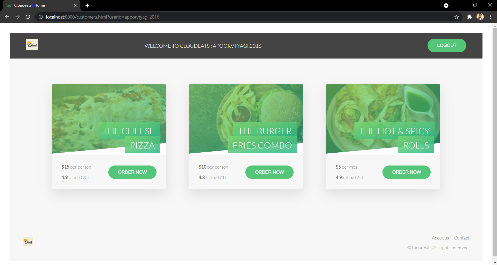
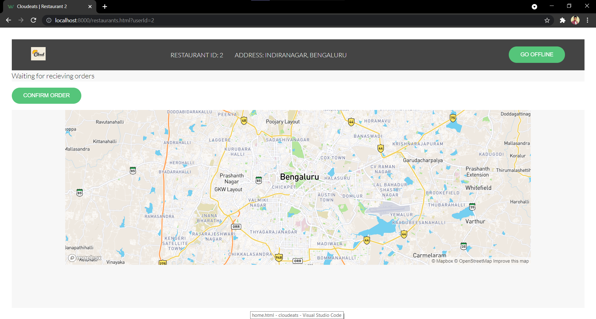
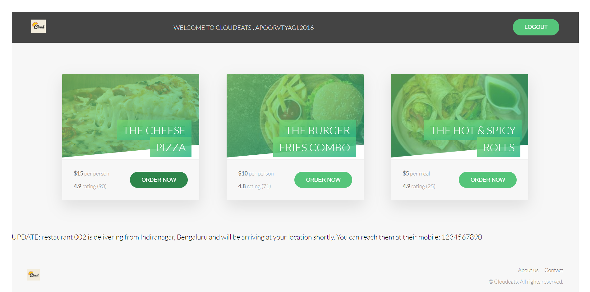
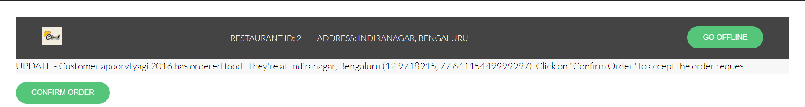
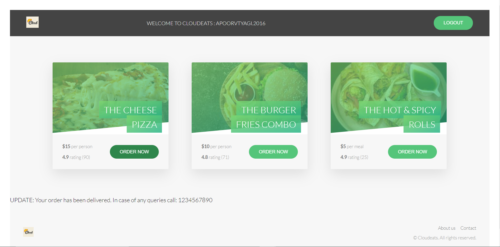

# Cloudeats
A cloud kitchen app for a chain of restaurants. Made using `Node.js`, `Express.js`, `HTML` and `MongoDB`.

> 

### How to install:
- Clone or fork this repo
- Install NodeJS and MongoDB
- Run `npm install`

### How to run:
- Run `node ./app.js`
- Open a demo customer page by going to http://localhost:8000/login
- Open 1 or more Restaurant in separate tabs - [Restaurant 1](http://localhost:8000/restaurant.html?userId=1), [Restaurant 2](http://localhost:8000/restaurant.html?userId=2)

### Future Improvements
- Integrating Mapbox for Restaurants
- ETA for customer
- Restaurant Online/Offline Validations
- Variable distance (upto a limit) in case nearby restaurants not found
- Restaurants are able to set the count of max concurrent engagement with the customers

## Screenshots

- ### Customer

- ### Restaurant

- ### Customer Order Update

- ### Restaurant Order Update

- ### Customer Order Recieved

